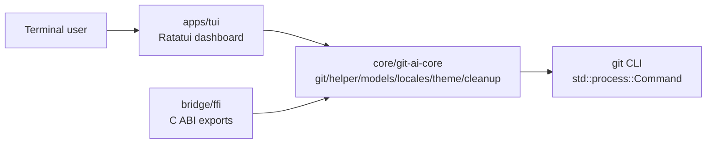
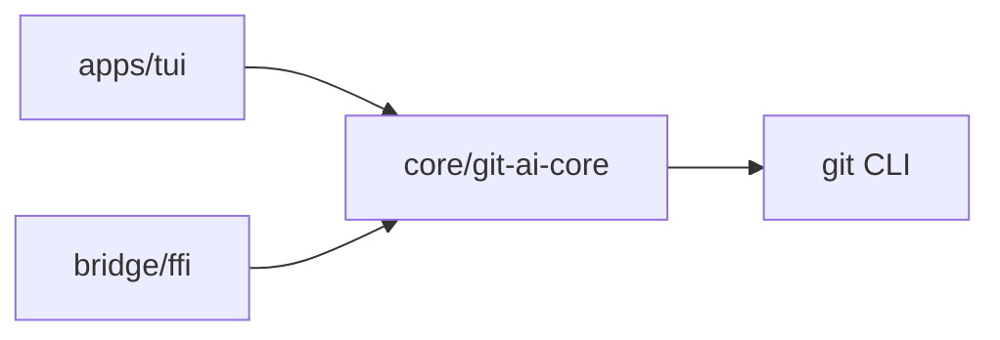

# Architecture Guide

`git-ai-gen` is organized as a workspace inspired by `look`: app shells live under `apps/`, shared Rust logic lives under `core/`, and bridge boundaries live under `bridge/`.

## Workspace Layout

```text
git-ai-gen/
├── apps/
│   └── tui/                 # Rust TUI package and current git-ai binary
├── bridge/
│   └── ffi/                 # Future dedicated C ABI crate
├── core/                    # Future pure/shared Rust crates
├── docs/
├── examples/
├── packaging/
│   ├── dist/
│   ├── homebrew/
│   └── macos/
├── scripts/
└── Cargo.toml               # workspace manifest
```

## Current Runtime Boundary

The current production app crate is `apps/tui`. Pure shared logic lives in `core/git-ai-core`. FFI exports live in `bridge/ffi`, which produces the static library artifact expected by native consumers.



## Package Boundary



Current and intended ownership:

- `core/git-ai-core`: Git wrappers, cleanup scanner, helper logic, models, theme data, locale helpers.
- `bridge/ffi`: `staticlib` / `cdylib` / `rlib` ABI package depending on `core/git-ai-core`.
- `apps/tui`: Ratatui dashboard, interactive CLI, modal/event handlers, and app state.

## Build Commands

From the workspace root:

```bash
cargo check
cargo check --no-default-features -p git-ai
cargo check -p git-ai-ffi
cargo test
cargo clippy --all-targets -- -D warnings
cargo clippy --no-default-features -p git-ai -- -D warnings
cargo clippy -p git-ai-ffi -- -D warnings
```

The same verification flow is available through:

```bash
scripts/check.sh
```

## Migration Rule

Keep each migration step buildable. The `git-ai-ffi` package owns ABI exports and keeps the `libgit_ai_core` library name for downstream native consumers.
