# Research & Architectural Proposal: Bridging Rust Core to Native macOS SwiftUI App

This document presents a comprehensive research and architectural design for building a native macOS desktop application for **git-ai** by bridging the existing Rust core logic with a modern native Swift/SwiftUI interface. This decouples the core logic from the TUI (Terminal User Interface) while preserving the high-performance Git wrapper and AI generation engines.

---

## 📐 Architectural Overview

There are two primary approaches to connect a Rust backend with a Swift macOS frontend.

```mermaid
graph TD
    subgraph "Approach A: Library Binding (High Integration)"
        SwiftUI[SwiftUI macOS UI] -->|Direct Native Calls| SwiftBinding[Swift Wrapper Class]
        SwiftBinding -->|C FFI / UniFFI Bridge| RustLib[Rust Static Library .a]
        RustLib -->|Core Logic| GitCommandA[Git Status / AI Commit Engine]
    end

    subgraph "Approach B: IPC CLI Piping (Decoupled)"
        SwiftUI2[SwiftUI macOS UI] -->|Process Launch / Pipe| NSTask[Process / NSTask Wrapper]
        NSTask -->|JSON StdIn / StdOut| RustCLI[git-ai CLI Binary]
        RustCLI -->|Core Logic| GitCommandB[Git Status / AI Commit Engine]
    end
```



---

## ⚖️ Detailed Comparison of Approaches

### Approach A: Library Binding via FFI / UniFFI

The Rust core is compiled into a static library (`libgit_ai_core.a`) for macOS architectures (Apple Silicon and Intel). A binding layer exposes these functions natively to Swift.

- **Pros**:
  - **Ultra-Performance**: Direct memory sharing, zero process startup overhead.
  - **Single Process**: Easier distribution via the Mac App Store, no sandboxing issues with child processes.
  - **Tight Integration**: Can pass complex Swift structs, arrays, and callback closures directly to Rust.
- **Cons**:
  - Complex build pipeline requiring Xcode to trigger cargo compilation during build cycles.

### Approach B: Inter-Process Communication (IPC) via CLI Piping

The SwiftUI application acts as a clean graphical wrapper that spawns the compiled Rust `git-ai` binary as a background process (`Process` / `NSTask`) and communicates via stdout/stdin pipes using a JSON format.

- **Pros**:
  - **Zero Rust Modifications**: Existing CLI wrappers are reused without modification.
  - **Isolated Environments**: Crashes in the Swift UI don’t crash the Git engine, and vice versa.
  - **Easy Debugging**: Both parts can be compiled and debugged independently.
- **Cons**:
  - Process spawning overhead.
  - macOS Sandboxing constraints (requires explicit permissions to launch child binaries in App Store environments).

> [!TIP]
> **Recommendation**: For this project, **Approach A (Library Binding)** using **UniFFI** is highly recommended. It creates a premium, professional native application, completely self-contained, with outstanding responsiveness.

---

## 🛠 Option A Implementation: Native Library Binding (UniFFI)

Mozilla's `uniffi-rs` is the industry standard for bridging Rust and Swift. It automatically generates the Swift classes and FFI boilerplate.

### 1. Rust Side Setup (`Cargo.toml` & Core Export)

We add `staticlib` to crate type and configure `uniffi` dependencies.

```toml
[lib]
name = "git_ai_core"
crate-type = ["staticlib", "cdylib"]

[dependencies]
uniffi = { version = "0.25", features = ["cli"] }
```

We define our Rust core API (`src/lib.rs`):

```rust
// Core Rust structures exposed to Swift
#[derive(uniffi::Record)]
pub struct ChangedFileSwift {
    pub status: String,
    pub path: String,
}

#[derive(uniffi::Object)]
pub struct GitAiCore {}

#[uniffi::export]
impl GitAiCore {
    #[uniffi::constructor]
    pub fn new() -> Self {
        GitAiCore {}
    }

    pub fn get_status(&self) -> Vec<ChangedFileSwift> {
        // Calls git::status wrappers
        vec![
            ChangedFileSwift {
                status: " M".to_string(),
                path: "src/main.rs".to_string(),
            }
        ]
    }

    pub fn generate_commit_message(&self, diff: String) -> String {
        // Calls Kilo AI logic
        format!("feat(core): dynamically bound Swift UI\n\nGenerated via Rust Core.")
    }
}

// Generate the UniFFI bindings boilerplate
uniffi::setup_scaffolding!();
```

---

### 2. Compiling the Library for Apple Architectures

To support both M1/M2/M3 (Apple Silicon) and older Intel Macs, we compile static libraries for both targets and bundle them into a single **Universal Lipu Static Library** or a modern **XCFramework**.

```bash
# Install targets
rustup target add aarch64-apple-darwin
rustup target add x86_64-apple-darwin

# Build static libraries
cargo build --release --target aarch64-apple-darwin
cargo build --release --target x86_64-apple-darwin

# Combine into a Universal Binary
lipo -create \
  target/aarch64-apple-darwin/release/libgit_ai_core.a \
  target/x86_64-apple-darwin/release/libgit_ai_core.a \
  -output libgit_ai_core_universal.a
```

---

### 3. Swift UI Integration

Once the generated `.swift` wrapper and the static library are added to Xcode, calling the Rust engine from a SwiftUI ViewModel is completely native:

```swift
import SwiftUI

class GitDashboardViewModel: ObservableObject {
    @Published var changedFiles: [ChangedFileSwift] = []
    @Published var commitMessage: String = ""
    @Published var isGenerating: Bool = false

    // Instantiate the bridged Rust Core
    private let core = GitAiCore()

    func refreshStatus() {
        // Call Rust directly!
        self.changedFiles = core.getStatus()
    }

    func generateAICommit(diff: String) {
        self.isGenerating = true
        DispatchQueue.global(qos: .userInitiated).async {
            // Call Rust AI generator in background thread
            let message = self.core.generateCommitMessage(diff: diff)
            DispatchQueue.main.async {
                self.commitMessage = message
                self.isGenerating = false
            }
        }
    }
}
```

---

## 🎨 macOS Native SwiftUI Dashboard Design

Here is a premium SwiftUI dashboard concept using modern macOS visual aesthetics (Sidebar layout, translucent materials, and high contrast detail view).

```swift
struct GitAiDashboardView: View {
    @StateObject private var viewModel = GitDashboardViewModel()
    @State private var selectedFilePath: String? = nil

    var body: some View {
        NavigationSplitView {
            // Left Column: Changed Files List
            List(viewModel.changedFiles, id: \.path, selection: $selectedFilePath) { file in
                HStack {
                    Text(file.status)
                        .font(.system(.body, design: .monospaced))
                        .foregroundColor(file.status.contains("M") ? .orange : .green)
                        .padding(.horizontal, 4)
                        .background(Color.secondary.opacity(0.1))
                        .cornerRadius(4)

                    Text(file.path)
                        .font(.body)
                }
            }
            .navigationTitle("Staged / Unstaged")
            .toolbar {
                Button(action: viewModel.refreshStatus) {
                    Label("Refresh", systemImage: "arrow.clockwise")
                }
            }
        } detail: {
            // Middle & Right: Code Diff and AI Generation panel
            if let selectedFile = selectedFilePath {
                VSplitView {
                    // Top detail: Live Diff view with syntax styling
                    ScrollView {
                        Text("--- a/\(selectedFile)\n+++ b/\(selectedFile)\n+ // code added dynamically...")
                            .font(.system(.body, design: .monospaced))
                            .padding()
                            .frame(maxWidth: .infinity, alignment: .leading)
                    }

                    // Bottom detail: AI Generation Card Panel
                    VStack(alignment: .leading, spacing: 12) {
                        HStack {
                            Text("🤖 AI Commit Assistant")
                                .font(.headline)
                            Spacer()
                            if viewModel.isGenerating {
                                ProgressView().controlSize(.small)
                            } else {
                                Button("Generate") {
                                    viewModel.generateAICommit(diff: "mock_diff")
                                }
                                .buttonStyle(.borderedProminent)
                            }
                        }

                        TextEditor(text: $viewModel.commitMessage)
                            .font(.system(.body, design: .monospaced))
                            .padding(4)
                            .border(Color.secondary.opacity(0.2))
                            .cornerRadius(4)
                    }
                    .padding()
                    .background(VisualEffectView(material: .hudWindow, blendingMode: .withinWindow))
                }
            } else {
                Text("Select a file to view Diff and generate AI commits")
                    .foregroundColor(.secondary)
            }
        }
        .onAppear {
            viewModel.refreshStatus()
        }
    }
}

// Translucent window background helper (macOS blur effect)
struct VisualEffectView: NSViewRepresentable {
    var material: NSVisualEffectView.Material
    var blendingMode: NSVisualEffectView.BlendingMode

    func makeNSView(context: Context) -> NSVisualEffectView {
        let view = NSVisualEffectView()
        view.material = material
        view.blendingMode = blendingMode
        view.state = .active
        return view
    }

    func updateNSView(_ nsView: NSVisualEffectView, context: Context) {
        nsView.material = material
        nsView.blendingMode = blendingMode
    }
}
```

---

## 🚀 Recommended Implementation Roadmap

1. **Phase 1: Shared Core Extraction (1-2 weeks)**
   - Move git parsing and AI calling logic from `src/app/` into the pure library wrapper in `src/git/` or a new `git-ai-core` workspace crate.
   - Expose methods using `UniFFI`.
2. **Phase 2: Automated Xcode Bridge Scripting (3 days)**
   - Add a custom shell-script phase in Xcode project to automatically trigger `cargo build --lib` during macOS App compiles, keeping Swift code always synced with Rust edits.
3. **Phase 3: SwiftUI Interface Design (1-2 weeks)**
   - Build the premium macOS SwiftUI interface utilizing modern sidebars, quick-view file trees, and responsive live diff windows.
4. **Phase 4: Distribution & Testing (1 week)**
   - Test sandboxing permissions for Git directory access (`File Access` capability in Xcode).
   - Bundle universal binaries as `XCFramework` for clean distribution.
